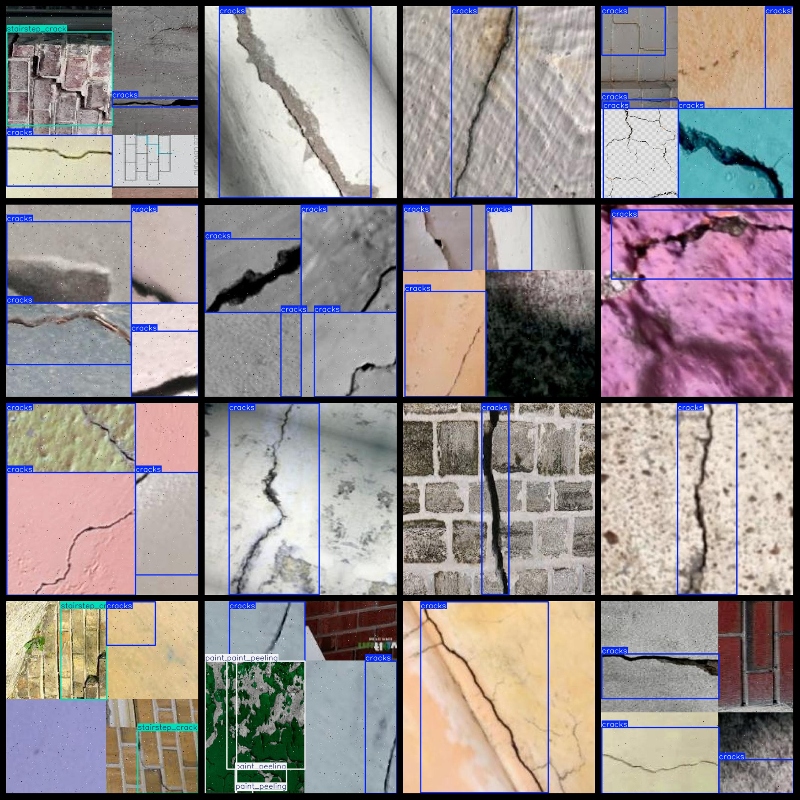
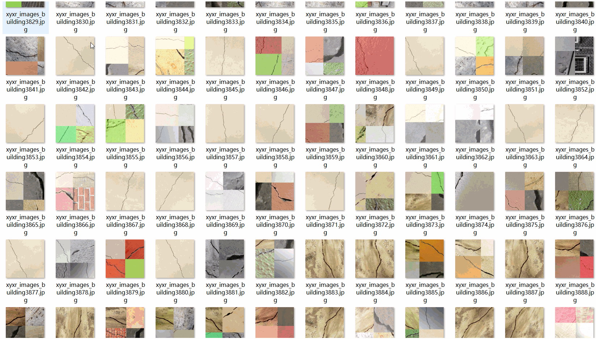

# Building Wall Surface Defect Detection Dataset: 7374 Images in VOC+YOLO Format

This dataset is specifically designed for building wall surface defect detection, comprising a total of 7374 images in both VOC and YOLO formats. The dataset is organized into three main folders: JPEGImages, Annotations, and labels. Each folder contains specific file types for easy access and manipulation.

In the JPEGImages folder, there are a total of 7374 JPEG images, each with their respective filenames. The Annotations folder contains 7374 XML files, detailing the annotations for each image. Additionally, there are 7374 TXT files in the labels folder, providing detailed information about the defects detected in each image.

The labels dataset consists of 5 different defect categories: "cracks", "mildew", "paint_peeling", "stairstep_crack", and "water_seepage". For each category, the dataset provides an estimation of the number of instances (frames) in the YOLO format, based on the classes.txt file within the labels folder.

For example, the number of frames for "cracks" is 17288, "mildew" is 597, "paint_peeling" is 1081, "stairstep_crack" is 1627, and "water_seepage" is 629. The total number of frames across all categories is 21222.

The images in this dataset are of high resolution, ensuring clarity and detail for accurate defect detection. The majority of the images have been enhanced through methods such as stitching and rotation to increase their representational power.

The dataset is hosted on the GitHub repository named datasets_sl, where it can be easily accessed and utilized by researchers and developers interested in building wall surface defect detection models.

It is important to note that this dataset does not guarantee the accuracy or precision of any trained models or weight files. It only provides accurate and reasonable annotation for use in training.

The dataset's annotation and image details are as follows:

## Images

---

Here is a pay link on Stripe (https://buy.stripe.com/3cs8yP7sY87d0vu9AB). Please contact me lonlonago@foxmail.com after funding $89, and I will send you a complete data files, thank you!

